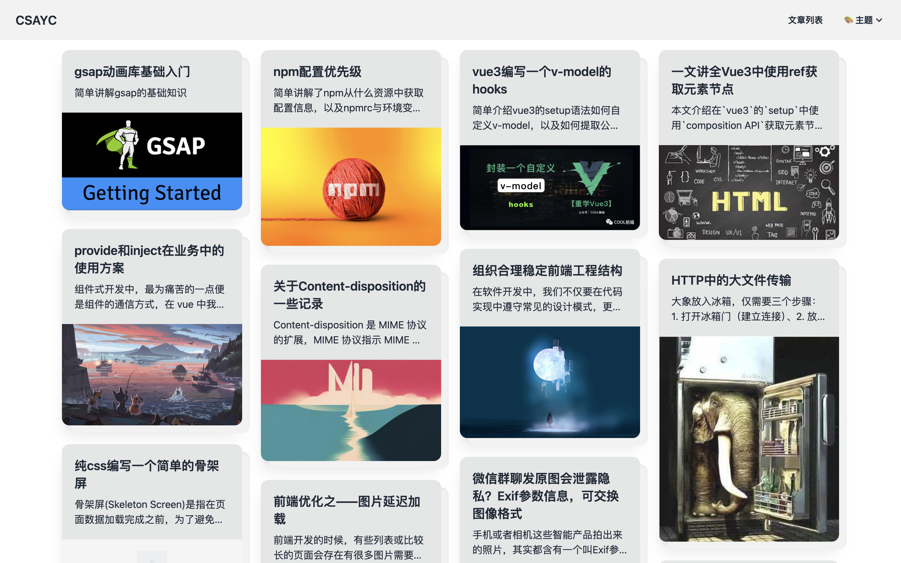

本博客使用`Nuxt3`同构渲染搭建，引入`@nuxt/content`解析`md`文件。
主要技术点有：
- 样式：taiwindcss➕postcss➕daisyui
- 主要框架：vue3➕nuxt3
- 动画：gsap
- 部署：腾讯云服务器➕coding平台自动化部署
- 监控：pm2➕宝塔

ps：比较遗憾自己因工作原因，从0到1建立基础的博客功能以来，并无多少时间持续输出文章！目前已不太满足`Nuxt3`开发博客了，最近（24年4月底）开始研究使用`astro`从头搭建自己的博客平台；

目前已经实现的功能有
- [x] 首页 gsap 酷炫滚动动画
- [x] 多主题切换
- [x] pc 文章列表瀑布流
- [x] 移动 pc 双端适应
- [x] 文章toc目录锚点
- [x] 图片原位放大器
- [x] 引入`codePen`展示代码及运行效果
- [x] 腾讯coding平台自动化部署

欢迎大家来到我的博客：[在线体验](https://www.csayc.com")
# 部分效果展示
## 文章详情页

## 文章列表页

